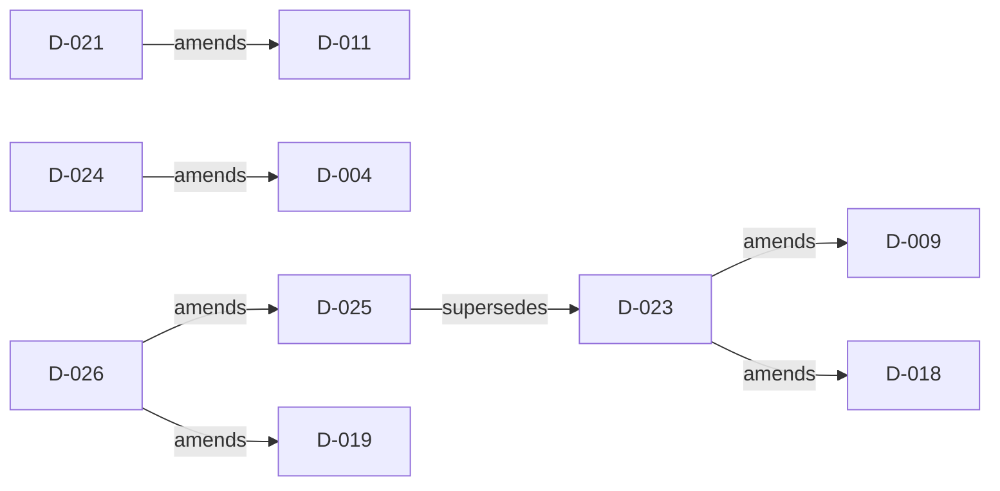

# Architecture Decision Records

This index is generated by `eng/validate-adrs.sh --write-index` from the
validated ADR metadata. Manual edits are rejected by the governance gate.

## Decision Index

| ID | Status | Date | Decision | Relationships |
|---|---|---|---|---|
| [D-001](D-001-ef-core-service-decorator.md) | implemented | 2026-05-16 | Centralize EF Core service decoration | - |
| [D-002](D-002-database-scoped-advisory-lock.md) | implemented | 2026-05-16 | Scope migration advisory locks by database | - |
| [D-003](D-003-hilo-state-cache-lifetime.md) | implemented | 2026-05-16 | Bound and isolate shared HiLo state | - |
| [D-004](D-004-engineprofile-modell.md) | implemented | 2026-05-16 | Route engine behavior through EngineProfile | amended by D-024 |
| [D-005](D-005-scaffolding-loader-hierarchy.md) | implemented | 2026-05-16 | Split reverse engineering into aspect loaders | - |
| [D-006](D-006-default-decimal-breaking-change.md) | implemented | 2026-05-16 | Use decimal(18,2) as the default mapping | - |
| [D-007](D-007-multirow-insert-returning.md) | implemented | 2026-05-16 | Use shape-aware multi-row INSERT and RETURNING | - |
| [D-008](D-008-public-api-vertrag.md) | implemented | 2026-05-16 | Gate the public API with PublicApiAnalyzers | - |
| [D-009](D-009-efcore-patch-coupling.md) | implemented | 2026-05-16 | Support an EF Core patch range with a floor/latest matrix | amended by D-023 |
| [D-010](D-010-activity-meter-surface.md) | implemented | 2026-05-16 | Emit a diagnostic triple for significant operations | - |
| [D-011](D-011-spec-test-subklassen-strategie.md) | implemented | 2026-05-16 | Adopt the official EF Core relational specification corpus | amended by D-021 |
| [D-012](D-012-spatial-engine-detail.md) | implemented | 2026-05-16 | Adapt spatial materialization per engine | - |
| [D-013](D-013-ef-core-11-upgrade.md) | accepted | 2026-05-16 | Trigger the EF Core 11 upgrade as a new major line | - |
| [D-014](D-014-mysql-8.0-support.md) | accepted | 2026-05-16 | Exclude MySQL 8.0 from the supported release matrix | - |
| [D-015](D-015-json-query-warning-suppression.md) | implemented | 2026-05-17 | Scope JSON query warning behavior to its fixture | - |
| [D-016](D-016-scalar-convert-to-boolean-vocabulary.md) | implemented | 2026-05-18 | Keep scalar boolean parsing aligned with the BCL | - |
| [D-017](D-017-nativeaot-smoke-deferred.md) | implemented | 2026-05-18 | Defer NativeAOT until the EF Core path is supportable | - |
| [D-018](D-018-coverage-gate-calibration.md) | implemented | 2026-05-18 | Enforce coverage by shipped assembly and risk-critical class | amended by D-023 |
| [D-019](D-019-performance-gate-architecture.md) | implemented | 2026-05-18 | Gate performance and resource behavior at the publication boundary | amended by D-026 |
| [D-020](D-020-test-owned-database-lifecycle.md) | accepted | 2026-07-27 | Make live tests own their database lifecycle | - |
| [D-021](D-021-provider-completeness-and-spec-dispositions.md) | implemented | 2026-07-27 | Enforce a zero provider-gap specification ledger | amends D-011 |
| [D-022](D-022-madr-enterprise-profile.md) | implemented | 2026-07-27 | Adopt MADR 4.0.0 with the Doka enterprise profile | - |
| [D-023](D-023-tiered-ci-verification.md) | superseded | 2026-07-31 | Use tiered CI verification under a fixed runner budget | superseded by D-025; amends D-009, D-018 |
| [D-024](D-024-cte-and-temporal-table-contract.md) | accepted | 2026-08-04 | Support native CTEs and portable temporal tables | amends D-004 |
| [D-025](D-025-public-repository-verification-model.md) | accepted | 2026-08-08 | Verify on every event and harden the workflow surface for a public repository | supersedes D-023; amended by D-026 |
| [D-026](D-026-release-qualification-and-paired-performance.md) | proposed | 2026-08-09 | Qualify releases from bound evidence and paired performance runs | amends D-019, D-025 |

## Relationship Graph

