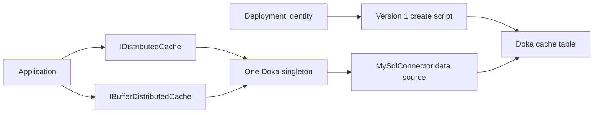

# Distributed Cache

`Doka.Caching.MySql` is a standalone .NET 10 cache package backed by MySQL or
MariaDB through MySqlConnector. It implements `IDistributedCache` and
`IBufferDistributedCache` on the same singleton. It does not depend on the EF
Core provider or an application `DbContext`.

This package is introduced in
[10.1.0-rc.1](../CHANGELOG.md#1010-rc1---2026-08-26); it is not part of the
`10.0.0` release. The tested database lines are listed in
[Supported Databases](supported-databases.md).

Install the release candidate explicitly for consumer validation:

```bash
dotnet package add Doka.Caching.MySql --version 10.1.0-rc.2
```

## Deployment and Registration

Create the database through your normal deployment process. Generate the
table script with the cache package, then review and execute it with a
deployment identity:

```csharp
using Doka.Caching.MySql;

var script = MySqlCacheSchema.GetCreateScript("app_cache", "DistributedCache");
Console.WriteLine(script);
```

`MySqlCacheSchema.Version` is `1`. The generated `CREATE TABLE IF NOT EXISTS`
script is the versioned Doka DDL artifact; generating it does not connect to
the database. There is no additional schema-migration framework. The runtime
never creates or alters tables, including during registration and the first
cache operation.

`IF NOT EXISTS` makes creation repeatable. It does not check or upgrade an
existing table with a different shape. Use a Doka table created by this script,
not an existing table from another cache implementation. Review future schema
changes as explicit deployment changes.

### Incompatible Schema Changes and Rolling Deployment

The schema version describes the table layout, not the package version. Package
updates that keep the same schema can share a table. Neither registration nor
cache operations compare the table comment or shape with `MySqlCacheSchema.Version`;
table names are application configuration and are not automatically versioned.
Successful dependency injection or `CREATE TABLE IF NOT EXISTS` therefore does
not prove that an existing table matches the running package.

For a future incompatible schema change, provision a separate table with that
package's deployment script. For example, old instances can keep
`DistributedCache_v1` while new instances use `DistributedCache_v2`. These names
illustrate deployment isolation; Doka currently provides only schema version 1.
Do not point old instances at a new incompatible table or alter their table
in place while they are still running.

Validate write/read/remove with the new application's database identity before
routing traffic to it. Keep the old table and its configuration available until
all old instances have stopped and the rollback window has closed. A rollback
must restore the matching package and table configuration together. Retire the
old table only after that point; the cache never performs this step itself.

Separate tables do not synchronize values or invalidations. Each generation
warms independently, and a removal in one does not invalidate the other. If the
application requires shared invalidation during the overlap, use an explicitly
coordinated cutover instead of assuming that table isolation preserves it.

### Registration

Register the cache after provisioning the table:

```csharp
using Doka.Caching.MySql;
using Microsoft.Extensions.DependencyInjection;

services.AddDistributedMySqlCache(options =>
{
    options.ConnectionString = connectionString;
    options.SchemaName = "app_cache";
    options.TableName = "DistributedCache";
});
```

`SchemaName` means the MySQL-family database containing the table. It is not
the unsupported EF Core schema option. Cache statements fully qualify this
database, so the connection string does not need to select a default database.
Grant the runtime identity `SELECT`, `INSERT`, `UPDATE`, and `DELETE` on this
table; it needs no `CREATE`, `ALTER`, or `DROP` privilege. Keep credentials in
the application's secret/configuration system and configure transport security
through MySqlConnector.

Registration selects the same Doka instance for `IDistributedCache` and
`IBufferDistributedCache` without deleting foreign registrations. Earlier
registrations remain available through `IEnumerable<T>`. Repeated Doka
registration does not duplicate its aliases. Register only the intended cache
backend, then apply decorators; a later backend registration can override the
default selection again.

When the service collection contains a `TimeProvider`, the cache singleton uses
it to schedule the best-effort expired-row cleanup interval. Without that
registration it uses `TimeProvider.System`. This clock controls only when cleanup
is attempted; entry expiration and relative or sliding deadlines continue to use
database UTC.

The service provider owns the singleton. With `ConnectionString`, the cache
creates and owns its MySqlConnector data source. Alternatively, supply an
existing data source to share a pool or use driver-managed authentication:

```csharp
using MySqlConnector;

await using var dataSource = new MySqlDataSourceBuilder(
    new MySqlConnectionStringBuilder(connectionString)
    {
        AutoEnlist = false,
    }.ConnectionString).Build();

services.AddDistributedMySqlCache(options =>
{
    options.DataSource = dataSource;
    options.SchemaName = "app_cache";
    options.TableName = "DistributedCache";
});
```

Choose exactly one connection source. A supplied `DataSource` remains
caller-owned: keep it alive until the host/service provider has been disposed.
The cache uses that exact instance, including its connection callbacks, and
never disposes it. Configure rotating credentials through
`MySqlDataSourceBuilder`; Doka does not introduce another authentication layer.
An externally supplied source must already have `AutoEnlist=false`.

Consumers must not dispose the resolved cache. Each operation acquires and
disposes its connection; MySqlConnector owns pooling. Doka never shares an
open connection across concurrent operations. Auto-enlistment is disabled for
the connection-string path and validated for supplied sources: neither joins an ambient
`TransactionScope`. Cache writes and cleanup have their own lifetime, so an
application transaction cannot retain cache locks or roll back cache entries.



## Configuration Contract

| Option | Default | Contract |
| --- | --- | --- |
| `ConnectionString` | None | Valid, non-whitespace MySqlConnector connection string; mutually exclusive with `DataSource`. |
| `DataSource` | None | Caller-owned `MySqlDataSource` with `AutoEnlist=false`; supply it or `ConnectionString`, not both. |
| `SchemaName` | None | Existing database name, validated and quoted once. |
| `TableName` | None | Doka cache table name, validated and quoted once. |
| `DefaultSlidingExpiration` | 20 minutes | Used only when an entry supplies no expiration; at least one microsecond. |
| `ExpiredItemsDeletionInterval` | 30 minutes | Delay after a drained or failed cleanup attempt; at least five minutes. Full batches continue on subsequent cache calls. |

Options are validated at host startup through `ValidateOnStart`, or when
options/cache services are first resolved without a host. Structural
validation does not test credentials, connectivity, table existence, or
permissions; a deployment smoke check must exercise a write/read/remove.

Identifiers must be non-whitespace, at most 64 BMP characters, and contain
neither NUL nor surrogates nor a trailing space. Backticks inside a name are
doubled when quoting. Names are configuration, never SQL fragments; schema
and table are quoted separately.

Keys must be nonempty, valid UTF-16 strings encoding to at most 1,024 UTF-8
bytes. They are stored and compared as binary data: case and trailing spaces
are significant, and Doka performs no Unicode normalization. An empty value
is valid and distinct from a missing entry. Values are opaque bytes; Doka
does not serialize, compress, or interpret application payloads.

## Operations and Expiration

Existing `IDistributedCache` consumers keep their standard operations:

```csharp
using Microsoft.Extensions.Caching.Distributed;

await cache.SetAsync(
    "catalog:42",
    payload,
    new DistributedCacheEntryOptions
    {
        AbsoluteExpirationRelativeToNow = TimeSpan.FromMinutes(10),
        SlidingExpiration = TimeSpan.FromMinutes(2),
    },
    cancellationToken);

var cached = await cache.GetAsync("catalog:42", cancellationToken);
await cache.RefreshAsync("catalog:42", cancellationToken);
await cache.RemoveAsync("catalog:42", cancellationToken);
```

| Entry options | Expiration behavior |
| --- | --- |
| No expiration supplied | Uses `DefaultSlidingExpiration`. |
| `AbsoluteExpiration` | Uses the supplied instant converted to UTC. |
| `AbsoluteExpirationRelativeToNow` | Adds the duration to database UTC at `Set`. If both absolute forms are supplied, this relative form takes precedence. |
| `SlidingExpiration` | Successful reads and explicit refreshes extend the lifetime from database UTC. |
| Absolute plus sliding | Uses the earlier deadline; refresh never extends beyond the absolute cap. |

Expiration comparison and relative/sliding deadlines use `UTC_TIMESTAMP(6)`
on the database, not individual application clocks or session time zones.
Fixed `AbsoluteExpiration` is still an application-supplied instant; callers
are responsible for choosing it correctly. A past absolute deadline makes
the new entry immediately unreadable, rather than being rejected based on
the application machine's clock. Keep database server clocks synchronized
when a deployment can fail over between servers.

Durations must be at least one microsecond. Storage uses `datetime(6)`;
sub-microsecond precision is not retained. Absolute dates must be within the
database's representable range, and database/driver limits still apply to
extreme durations and payload sizes.

`Set` uses one atomic upsert for value and expiration metadata. Its single-row
derived table binds the payload once and reuses that row on conflict, so the
value is not transmitted separately for insert and update. A `Get` reads
only unexpired rows and conditionally refreshes the revision it read; a
concurrent overwrite is not refreshed using stale read state. Explicit
`Refresh` updates only an unexpired sliding entry. Neither refresh path
recreates removed or expired entries. `Remove` deletes the current key;
concurrent operations are resolved by database statement ordering, not by a
cross-request lock. This is a cache, not a compare-and-swap or distributed-lock
API.

Sliding refresh uses a short `READ COMMITTED` transaction: it first locks the
key, then starts a separate update statement with a fresh database timestamp.
This prevents a refresh delayed by another writer from reviving a row that
expired during the lock wait. No value streaming occurs under this lock.
Absolute-only reads need no refresh transaction; sliding reads incur the
additional lock/update and commit work. Reads of the same sliding key serialize
their refreshes; database/driver timeouts and cancellation still apply. The
lock and update reuse one command and parameter set but execute as separate
commands. MySQL evaluates
[`UTC_TIMESTAMP()` at query start](https://dev.mysql.com/doc/refman/8.4/en/date-and-time-functions.html#function_utc-timestamp),
so the update must start after the lock has been acquired.
[MariaDB 10.11.14's batch dispatcher](https://github.com/MariaDB/server/blob/mariadb-10.11.14/sql/sql_parse.cc#L1983)
also skips its ordinary timestamp-reset branch for WSREP sessions. Keeping
separate commands avoids relying on that batch behavior; this is a source-based
precaution, not a Galera-cluster validation claim.

Skipping a contended refresh or using `NOWAIT` would
change the successful-read contract, not merely optimize it. Serial sliding,
parallel sliding hot-key, and absolute-only reads are benchmarked separately.

Sync methods use synchronous I/O; async methods use asynchronous I/O and pass
cancellation to connection, command, and reader operations. A canceled or
failed core operation propagates its error, including sliding refresh, not a
false cache miss. A canceled write
may already have reached the database; cancellation does not promise rollback.
Best-effort cleanup runs after the core operation; its cancellation does not
discard a completed read or report a completed write as failed.

## Buffer Ownership and Memory

Resolve `IBufferDistributedCache` when the consumer already owns buffers:

```csharp
using System.Buffers;
using Microsoft.Extensions.Caching.Distributed;

var bufferCache = serviceProvider.GetRequiredService<IBufferDistributedCache>();
var writer = new ArrayBufferWriter<byte>();
var found = await bufferCache.TryGetAsync("catalog:42", writer, cancellationToken);

ReadOnlySequence<byte> sequence = new(payload);
await bufferCache.SetAsync(
    "catalog:42",
    sequence,
    new DistributedCacheEntryOptions
    {
        AbsoluteExpirationRelativeToNow = TimeSpan.FromMinutes(10),
    },
    cancellationToken);
```

Here `serviceProvider` is the built service provider and `payload` is the consumer's
byte array. A miss returns `false` without writing; a present empty value
returns `true` with zero bytes. A hit appends to the supplied writer. If an
exception occurs after writing starts, discard the partial result.

The read path copies directly from the connector's row-backed stream into the
destination; Doka does not allocate another value-sized result array. This is
not a zero-copy read path.
MySqlConnector 2.5.0 nevertheless allocates a receive buffer for packets larger
than its 16 KiB buffer, including each 1 MiB row. `IDistributedCache.Get` adds
the returned byte array; the buffer interface eliminates that second copy,
not the driver-owned receive buffer or the caller's destination.

A single-segment `ReadOnlySequence<byte>` is passed as memory without
flattening. A multi-segment write uses a rented contiguous buffer required by
the connector parameter path, clears the used portion, and returns it in all
completion paths. Renting can allocate on a cold pool and still requires a
copy; it is not a zero-copy guarantee. Keep input memory valid and unchanged
until the operation completes.

## Cleanup and Operational Boundaries

After a successful cache operation, one caller per singleton may perform one
expired-row deletion batch when the configured interval has elapsed. It first
reads at most 1,000 candidate keys through the expiration index without row
locks. A separate DELETE uses `FORCE INDEX (PRIMARY)` and parameterized key
equalities, checking current expiration again so a concurrent renewal survives.
This removes the expiration-index-first lock inversion with primary-key writes.
OR equalities avoid MariaDB's conversion of a full 1,000-element IN list into
a subquery. The live tests check PRIMARY range access for small and full batches.

A nonempty batch uses two statements on one connection, with no transaction
spanning candidate discovery and deletion. An empty batch needs only the read.
Only keys are buffered, at most 1,000 times 1,024 bytes plus managed collection,
parameter, and SQL storage; values are not loaded. The call waits for the
batch; there is no timer, unobserved task, or fire-and-forget work.

If all 1,000 candidate slots were used, the next successful cache call can
immediately delete the next batch, even when renewals or another instance's
cleanup reduce the number actually deleted. Only a candidate batch below the
limit, a failure, or cancellation
restarts the configured interval. Concurrent callers do not run cleanup for
the same singleton simultaneously. Each individual call still runs at most one
batch; no request drains an unbounded backlog.

Expired rows never become hits while waiting for physical cleanup. An idle
application does not clean them up. Drain capacity depends on successful calls
and database throughput, not a fixed 1,000-row-per-interval ceiling. Monitor
table size and the expired-row backlog; the cache provides
no capacity-based eviction or unlimited drain loop. Each application instance
has its own interval, so a fleet can issue multiple bounded batches.

The limit bounds candidate keys and deletions, not every scanned or locked row,
database lock waits, or elapsed time. Changed optimizer settings can widen the
scan even though the expiration index remains excluded from the DELETE search.
Use appropriate connector timeouts and a writable primary endpoint. A cleanup
failure is logged as a warning without turning a successful cache operation
into a failure. Cleanup uses the caller's token, but cancellation at this
maintenance-only stage is absorbed without a warning; core-operation
cancellation remains observable. Doka does not log cache keys,
values, connection strings, or raw exception messages. Cleanup diagnostics
contain only the exception type and database error number. Review separately enabled connector logging and
application logs under the same privacy policy.

This lock-order correction does not guarantee that all concurrent InnoDB
transactions are deadlock-free. A deadlock in the core operation still surfaces
as `MySqlException`; only maintenance failures are absorbed. Apply the
application's cache-failure policy, such as falling back to the source of truth
or a bounded retry where the operation's semantics permit it. Doka does not
silently retry cache operations.

For migration from another cache, deploy a new Doka table and switch the
registration to it. The cache warms from the application's normal source of
truth; do not migrate old cache values or delete the old table while old
instances still use it. See [Migrating from Pomelo](migrating-from-pomelo.md).

## Runnable Verification

Run the repository unit and functional checks with `./eng/test.sh`. Live
cache contracts run through `./eng/test-integration.sh` and cover both
database families, expiration, binary key equality, concurrent operations,
cancellation, and explicit schema deployment. Use the repository runtime and
benchmark entry points for the package's trimming/AOT and performance probes.

The existing benchmark contract covers 1 KiB and 1 MiB hits and writes,
misses, sliding refresh, multi-segment writes, and 16 parallel buffer reads
against both absolute-only entries and one shared sliding key.
The parallel sliding workload has both an allocation ceiling and a same-run
mean-time ratio limit against absolute-only reads, calibrated per engine
target in `benchmarks/performance-contract.json`. This ratio includes all
refresh transaction and round-trip costs; it is not a pure lock-duration or
machine-independent measurement. See the
[Performance Evidence Reference](operations/performance-evidence-reference.md)
for its interpretation and invalid-evidence rules.

For warmed 1 MiB reads, the buffer path's total allocation ceiling is 1 MiB
plus 64 KiB; ordinary byte-array reads have a 2 MiB plus 64 KiB ceiling.
The buffer/ordinary allocation ratio must not exceed 55%, protecting the
eliminated result copy. Large writes have a 1 MiB plus 64 KiB ceiling because
the .NET 10.0.11 macOS SecureTransport TLS path allocates outgoing encrypted
chunks. Linux uses pooled TLS output and can allocate less. These budgets
include operation, driver, and transport costs, exclude the caller-owned
reusable destination, and do not promise zero allocations on a cold pool.
TLS is not disabled or reconfigured to improve the measurements.

A deployment check must use the actual runtime identity to write, read, and
remove a temporary key after the table has been provisioned. Do not infer
database readiness from successful dependency injection alone.

## Primary Sources

Retrieved 2026-08-26:

- [MySqlConnector 2.5.0 data-source builder](https://github.com/mysql-net/MySqlConnector/blob/a86c07e8d04166a0334be6a2ce16351cf3804c9e/src/MySqlConnector/MySqlDataSourceBuilder.cs)
  owns connection callbacks and authentication configuration.
- [MariaDB 10.11.14 multi-statement dispatch](https://github.com/MariaDB/server/blob/mariadb-10.11.14/sql/sql_parse.cc#L1983)
  excludes WSREP sessions from its ordinary batch-dispatch timestamp reset.
  This source observation is not a live Galera-cluster test.
- [MySQL 8.4 current-time functions](https://dev.mysql.com/doc/refman/8.4/en/date-and-time-functions.html#function_utc-timestamp)
  bind UTC time to query start; the refresh update starts after the lock wait.
- [Microsoft cancellation guidance](https://devblogs.microsoft.com/premier-developer/recommended-patterns-for-cancellationtoken/)
  distinguishes cancellation before completion from already successful work.
- [.NET 10.0.11 buffer cache interface](https://github.com/dotnet/runtime/blob/v10.0.11/src/libraries/Microsoft.Extensions.Caching.Abstractions/src/IBufferDistributedCache.cs)
  defines the standard buffer methods and their relationship to
  `IDistributedCache`.
- [ASP.NET Core 10.0.11 expiration precedence](https://github.com/dotnet/aspnetcore/blob/v10.0.11/src/Caching/SqlServer/src/DatabaseOperations.cs)
  records relative-over-fixed absolute precedence; Doka's UTC authority and
  MySQL schema remain its own contracts.
- [MySqlConnector 2.5.0 row buffers](https://github.com/mysql-net/MySqlConnector/blob/a86c07e8d04166a0334be6a2ce16351cf3804c9e/src/MySqlConnector/Core/Row.cs)
  establishes the driver-owned buffer boundary used by `GetStream`.
- [MySqlConnector 2.5.0 packet reader](https://github.com/mysql-net/MySqlConnector/blob/a86c07e8d04166a0334be6a2ce16351cf3804c9e/src/MySqlConnector/Protocol/Serialization/BufferedByteReader.cs)
  shows the per-large-packet receive allocation.
- [.NET 10.0.11 macOS TLS writes](https://github.com/dotnet/runtime/blob/v10.0.11/src/libraries/System.Net.Security/src/System/Net/Security/SslStreamPal.OSX.cs)
  and [TLS payload allocation](https://github.com/dotnet/runtime/blob/v10.0.11/src/libraries/System.Net.Security/src/System/Net/Security/SslStream.Protocol.cs)
  define the transport allocation included in the write budget.
- [MySQL 8.4 identifiers](https://dev.mysql.com/doc/refman/8.4/en/identifiers.html)
  specifies quoting and character restrictions.
- [MySQL 8.4 upsert](https://dev.mysql.com/doc/refman/8.4/en/insert-on-duplicate.html)
  defines the atomic insert/update statement used by `Set`.
- [MySQL 8.4 InnoDB statement locks](https://dev.mysql.com/doc/refman/8.4/en/innodb-locks-set.html)
  describes secondary-to-clustered locking and nonlocking consistent reads.
- [MySQL 8.4 index hints](https://dev.mysql.com/doc/refman/8.4/en/index-hints.html)
  and [range optimization](https://dev.mysql.com/doc/refman/8.4/en/range-optimization.html)
  support the forced primary-key search with OR equality ranges.
- [MariaDB 10.11.18 IN-list conversion](https://github.com/MariaDB/server/blob/mariadb-10.11.18/sql/sql_tvc.cc#L1116)
  transforms lists at or above `in_subquery_conversion_threshold`.
- [MySQL 8.4 deadlock handling](https://dev.mysql.com/doc/refman/8.4/en/innodb-deadlocks-handling.html)
  explains why consistent lock order reduces risk without promising universal
  deadlock freedom.
- [MySQL 8.4 UTC time functions](https://dev.mysql.com/doc/refman/8.4/en/date-and-time-functions.html#function_utc-timestamp)
  defines the shared database-time basis for expiration.
