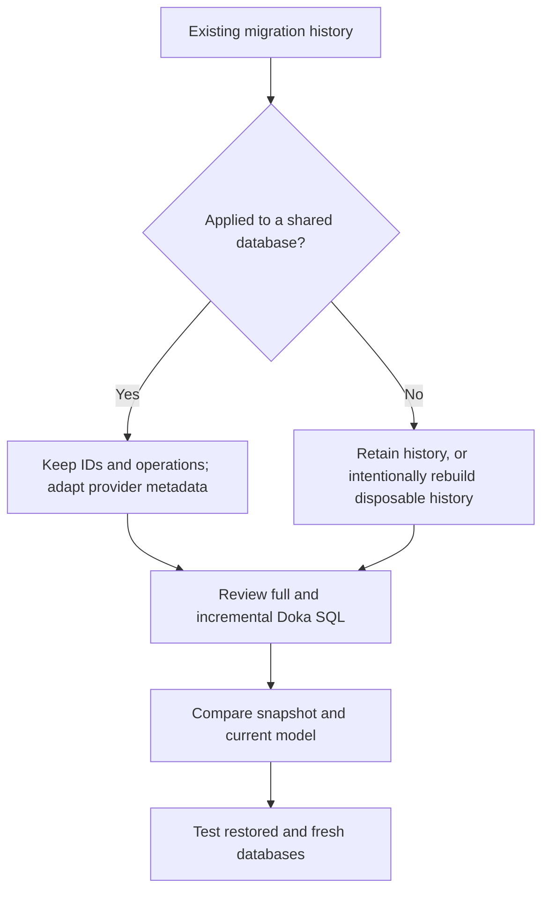

# Migrating from Pomelo

This guide covers concrete migration patterns found in an existing Pomelo
application. It is not an exhaustive inventory of Pomelo APIs or a promise
that every application migrates without changes. New, reproducible findings
can extend it without blocking the already documented paths.

The connection-string `AutoDetect`, scalar `Like<T>`, and `Doka.Caching.MySql`
features described here are available from
[10.1.0](../CHANGELOG.md#1010---2026-08-27), not the `10.0.0` packages.

## Scope and Preparation

Keep the provider replacement separate from intentional model changes. Record
the existing table definitions, column types, collations, GUID byte layout,
and applied migration IDs before editing generated files. Work against a
disposable database or a restored copy, not production.

Replace the `Pomelo.EntityFrameworkCore.MySql` package reference with
`Doka.EntityFrameworkCore.MySql` and remove Pomelo namespaces. Install the
stable package explicitly so the migration uses the documented version:

```bash
dotnet package add Doka.EntityFrameworkCore.MySql --version 10.1.2
```

Use:

```csharp
using Doka.EntityFrameworkCore.MySql;
using Microsoft.EntityFrameworkCore;
```

The application must target .NET 10 and EF Core 10. Keep EF Core package
versions aligned. Replacing an older provider does not perform the separate
EF Core major-version migration for the application.

Search known direct references and generated forms from the consumer root:

```bash
rg -n \
  --glob '*.cs' \
  --glob '*.csproj' \
  --glob '*.props' \
  --glob '*.targets' \
  -e 'Pomelo' \
  -e 'DelegationModes' \
  -e 'MySqlModelBuilderExtensions' \
  -e 'MySqlPropertyBuilderExtensions' \
  -e 'MySqlValueGenerationStrategy' \
  -e '"MySql:'
```

Repeated matches in migrations, designers, and snapshots usually represent
one generated pattern, not separate missing features. Some names also exist
in Doka, so review the namespace and arguments rather than requiring zero
matches. Compiler errors, model differences, and consumer tests identify
remaining concrete work; this search does not prove completeness.

## Connection and Server Configuration

Replace `ServerVersion.AutoDetect(connectionString)` with
`MySqlServerVersion.AutoDetect(connectionString)`:

```csharp
var connectionString = configuration.GetConnectionString("ApplicationDatabase")
    ?? throw new InvalidOperationException("ApplicationDatabase is not configured.");
var serverVersion = MySqlServerVersion.AutoDetect(connectionString);

optionsBuilder.UseMySql(connectionString, serverVersion);
```

The method opens and disposes one temporary connection synchronously, with
`AutoEnlist=false` so discovery stays outside any ambient transaction. It
preserves the other connection options and does not retain the connection
string or retry discovery. MySqlConnector owns pooling; the effective options
can select a different pool from normal provider connections. Reuse the
returned immutable descriptor when the server target is unchanged; detecting
inside every context factory adds a connection open to every factory call.
Tenant-specific configuration must resolve the
descriptor for the actual tenant target, not reuse an unrelated tenant's
server family.

When the family and version are already configured, no discovery is needed:

```csharp
var serverVersion = MySqlServerVersion.MariaDb(version);

services.AddDbContext<AppDbContext>(builder =>
    builder.UseMySql(connectionString, serverVersion, mysql => mysql
        .UseQuerySplittingBehavior(QuerySplittingBehavior.SplitQuery)
        .EnableRetryOnFailure(5, TimeSpan.FromSeconds(10))));
```

`MySqlServerVersion.MySql(version)` is the MySQL equivalent. Doka's retry
overload accepts count and delay, not Pomelo's third error-number argument;
an existing trailing `null` is removed. A non-null custom error list is not an
equivalent supported overload and requires a separate review of the intended
retry behavior.

Both `UseMySql(string, ...)` and `AutoDetect(string)` reject null, empty, and
whitespace connection strings immediately. Do not substitute `string.Empty`
for missing configuration. Detection returns the default `SupportedOnly`
descriptor; unsupported release lines are rejected during provider option
validation. See [Provider Configuration](provider-configuration.md) and
[Supported Databases](supported-databases.md).

## Model Configuration

| Existing form | Doka mapping | Migration significance |
| --- | --- | --- |
| `HasCharSet("utf8mb4", DelegationModes.ApplyToAll)` | `HasCharSet("utf8mb4")` at model scope; retain explicit entity overrides | Sets a default, not a promise to reproduce Pomelo's delegation expansion. Compare table and column DDL. |
| `UseCollation("utf8mb4_unicode_ci", DelegationModes.ApplyToAll)` | EF Core `UseCollation("utf8mb4_unicode_ci")`; keep explicit property collations where required | Collation changes can change equality, ordering, and uniqueness. Preserve the existing schema contract. |
| `UseGuidCollation("utf8mb4_unicode_ci")` | Explicit `Char36` mapping and property `UseCollation(...)` for the affected text GUIDs | No global Doka GUID-collation switch. Binary GUIDs do not use text collation. |
| `AutoIncrementColumns(modelBuilder)` | Doka generated-integer-key conventions, with explicit `UseMySqlAutoIncrementColumn()` for known generated properties | Remove the old model call only after preserving every intended generated column. |
| `UseMySqlIdentityColumn(b.Property<int>("Id"))` | `b.Property<int>("Id").UseMySqlAutoIncrementColumn()` | Preserves the auto-increment intent under Doka metadata. |

For the observed model defaults:

```csharp
modelBuilder.HasCharSet("utf8mb4");
modelBuilder.UseCollation("utf8mb4_unicode_ci");

modelBuilder.Entity<Product>()
    .Property(product => product.Id)
    .UseMySqlAutoIncrementColumn();

modelBuilder.Entity<Product>()
    .Property(product => product.ExternalId)
    .HasMySqlGuidFormat(MySqlGuidFormat.Char36)
    .UseCollation("utf8mb4_unicode_ci");
```

The explicit GUID property is an example of preserving an existing text
column, not an instruction to convert all GUID columns to text. Keep existing
`ApplyConfigurationsFromAssembly`, application value converters, and
`base.OnModelCreating(...)` behavior. They are not Pomelo features merely
because they appear beside the replaced calls.

### Preserve GUID Storage

Doka defaults to `Binary16`. If the existing model stores GUIDs as `char(36)`,
retain that format before generating any migration:

```csharp
optionsBuilder.UseMySql(connectionString, serverVersion, mysql =>
    mysql.DefaultGuidFormat(MySqlGuidFormat.Char36));
```

Use `HasMySqlGuidFormat(...)` to preserve mixed per-property formats. Changing
`char(36)` or `varchar(36)` to `binary(16)` is a data and schema migration, not
namespace cleanup. Doka rejects a generated in-place alteration whenever a
provider-owned GUID side resolves to a different physical representation.

Provider-owned `Char36` and `Binary16` properties remain `Guid` or `Guid?` in
the model, designer, snapshot, and generated `CreateTable`, `AddColumn`, and
`AlterColumn` operations. Do not add
`GuidToStringConverter` or configure a provider CLR type of `string` merely
because the store column is `char(36)`. Upgrade to 10.1.1 or later before
diagnosing `AlterColumn<string>(...)`, `AlterColumn<byte[]>(...)`, or unintended
`varchar(36)` output. If it persists, treat it as application model-metadata
drift and correct the configuration before applying the migration.

Doka `Binary16` uses big-endian GUID bytes. An existing `binary(16)` column
alone does not prove compatibility: old little-endian or time-swapped layouts
need an explicit, tested conversion. Round-trip known preexisting GUID values
and compare their stored bytes before accepting the replacement. Do not set
connector `GuidFormat` or `OldGuids` options behind Doka's model mapping.

The SQL type also cannot prove that an application-owned byte converter uses
Doka's byte order. Doka therefore rejects application-owned `binary(16)` to
native `Binary16` changes in both directions. Canonical application-owned
`char(36)` or `varchar(36)` to native `Char36` remains text-equivalent.

For any rejected transition, keep the source until its replacement has been
proved:

1. Add a nullable destination column.
2. Validate every source value and identify the exact binary layout before
   conversion.
3. Backfill with reviewed SQL and compare both representations in both
   directions.
4. Make the destination required only after validation succeeds.
5. Replace the source and restore its keys, indexes, and foreign keys.
6. Exercise representative reads and writes through the migrated model.

Validate text before calling `UNHEX`; strict server modes may reject malformed
input immediately. Do not rely on a transaction rollback around the whole
sequence: MySQL atomic DDL and MariaDB implicit-commit behavior do not provide
that portable boundary.

## Historical Migrations, Designers, and Snapshots

Do not delete or renumber already deployed migrations. Keep their IDs, order,
`Up`/`Down` intent, custom SQL, and migration-history table identity. EF Core
uses applied IDs to decide what remains; changing provider namespaces does
not mean the existing schema should be created again.

For the observed auto-increment annotation, replace both the key and the enum
value. The Doka enum is in `Doka.EntityFrameworkCore.MySql`:

```csharp
migrationBuilder.CreateTable(
    name: "Products",
    columns: table => new
    {
        Id = table.Column<int>(type: "int", nullable: false)
            .Annotation(
                "Doka:MySql:ValueGenerationStrategy",
                MySqlValueGenerationStrategy.AutoIncrement),
    },
    constraints: table => table.PrimaryKey("PK_Products", product => product.Id));

migrationBuilder.AlterColumn<int>(
        name: "Id",
        table: "Products",
        type: "int",
        nullable: false,
        oldClrType: typeof(int),
        oldType: "int")
    .Annotation(
        "Doka:MySql:ValueGenerationStrategy",
        MySqlValueGenerationStrategy.AutoIncrement);
```

The old pair is `"MySql:ValueGenerationStrategy"` with
`MySqlValueGenerationStrategy.IdentityColumn`. Translate matching
`OldAnnotation(...)` values as well when an existing operation records the
old strategy. Do not discard an annotation simply to make a file compile;
losing auto-increment metadata changes generated DDL.

In designer files and the current snapshot, use the same model/property
replacements as above. For example:

```csharp
modelBuilder.HasCharSet("utf8mb4");
modelBuilder.UseCollation("utf8mb4_unicode_ci");
b.Property<int>("Id").UseMySqlAutoIncrementColumn();
```

Preserve the model state represented by each historical designer, rather than
copying today's entire model into old files. A raw model/table
`"MySql:CharSet"` annotation maps to `"Doka:MySql:CharSet"`; preserve its value
and scope. Other old `"MySql:"` annotations need individual classification,
not a blanket prefix replacement.

`Relational:MaxIdentifierLength` is EF relational metadata, not a Pomelo
namespace. The observed value `64` can remain. `ProductVersion` identifies the
EF Core version that generated the model; do not replace it with a Doka
package version. Newly scaffolded files receive the current EF metadata from
the tooling.



Recreating migrations is an option only for an intentionally disposable,
unpublished history whose databases can also be recreated. It is not the
default provider-migration procedure. Keep the old history recoverable until
the replacement and all custom operations have been verified.

## Queries and Distributed Cache

Numeric, `DateTime`, and `Guid` calls retain the familiar shape:

```csharp
var pattern = $"%{search}%";
var matching = context.Users.Where(user =>
    user.NumericId != null && EF.Functions.Like(user.NumericId.Value, pattern));
```

Nullable scalar values can also be passed directly. `NULL` values do not
produce a `WHERE` match. Ordinary `string`/`string?` calls continue to bind to
EF Core's non-generic `Like`; explicit `Like<string>` has the same SQL
semantics. Remove Pomelo extensions before using the Doka generic overloads
to avoid ambiguous calls. See [Scalar LIKE](query-functions.md#scalar-like)
for supported types, GUID mapping, escaping, and index boundaries.

Replace `Pomelo.Extensions.Caching.MySql` with the separate
`Doka.Caching.MySql` package and its namespace. Existing `IDistributedCache`
calls remain unchanged:

```csharp
using Doka.Caching.MySql;

services.AddDistributedMySqlCache(options =>
{
    options.ConnectionString = connectionString;
    options.SchemaName = databaseName;
    options.TableName = "DokaCache";
});
```

Provision a new Doka table using `MySqlCacheSchema.GetCreateScript(...)`
before deploying. Do not point Doka at an old Pomelo table: the schema is a
Doka-owned contract, and the cache starts cold. Remove the old table only
after all old application instances have stopped using it. No Redis service
or EF `DbContext` is required. The exact deployment, expiration, cleanup, and
buffer contracts are in [Distributed Cache](distributed-cache.md).

## Runnable Verification

Run these commands in the consumer project, supplying `--project`,
`--startup-project`, and `--context` when its layout requires them:

```bash
dotnet build
dotnet ef migrations list
dotnet ef migrations script 0 --output artifacts/doka-full.sql
dotnet ef migrations script --idempotent --output artifacts/doka-idempotent.sql
dotnet ef migrations has-pending-model-changes
dotnet ef migrations add DokaMigrationProbe
```

Review the full script for preserved generated keys, charsets, collations,
GUID formats, custom SQL, and table names. Compare an incremental script from
the last deployed migration with the intended upgrade. A no-schema-change
provider replacement should produce an empty probe `Up` and `Down`; investigate
any operations instead of accepting them automatically. Do not apply the
probe. After reviewing it, remove only that newly created, unapplied probe
with `dotnet ef migrations remove`.

Apply the reviewed migration chain to a fresh disposable database and the
incremental path to a restored database with existing migration history.
Verify representative existing GUIDs and identities, new inserts, the actual
numeric/date/GUID search expressions, and cold-cache reads/writes. An empty
probe alone does not establish that historical DDL or existing data is safe.

Repository tests establish the Doka contracts, not success of an application
that has not been run. Consumer migration is verified only by that consumer's
build, reviewed SQL, and exercised behavior. This guide makes no claim that
the originating application migration has already completed.

## Primary Sources

Retrieved 2026-08-26 and reverified 2026-08-29:

- [EF Core managing migrations](https://learn.microsoft.com/ef/core/managing-schemas/migrations/managing)
  explains generated files, pending-model checks, and why deployed history
  must be retained.
- [EF Core applying migrations](https://learn.microsoft.com/ef/core/managing-schemas/migrations/applying)
  defines script generation and review before deployment.
- [MySqlConnector GUID formats](https://mysqlconnector.net/api/MySqlConnector/MySqlGuidFormatType/)
  distinguishes big-endian, little-endian, and time-swapped binary layouts.
- [MySQL `ALTER TABLE`](https://dev.mysql.com/doc/refman/8.4/en/alter-table.html)
  documents conversion behavior for changed column definitions.
- [MySQL atomic DDL](https://dev.mysql.com/doc/refman/8.4/en/atomic-ddl.html)
  defines the scope and limits of atomic data-definition statements.
- [MariaDB statements causing an implicit commit](https://mariadb.com/docs/server/reference/sql-statements/transactions/sql-statements-that-cause-an-implicit-commit)
  defines the transaction boundary around DDL.
- [Provider Configuration](provider-configuration.md),
  [Query Functions](query-functions.md), and
  [Distributed Cache](distributed-cache.md) own the Doka contracts and their
  additional primary-source references.
