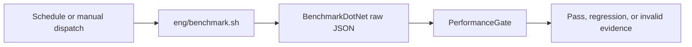

# Performance and Memory Evidence

This runbook is the operator entry point for provider benchmarks. The current
design has one measurement owner and one decision owner:



Performance evidence is independent of release qualification. The release
candidate neither invokes benchmarks nor consumes their artifacts.

## Choose the Right Document

| Task | Canonical owner |
| --- | --- |
| Run a target or diagnose a failure | This runbook |
| Interpret profiles, raw evidence, gate results, or soak | [Performance Evidence Reference](performance-evidence-reference.md) |
| Understand why paired comparisons were retired | [Paired Performance Methodology](paired-performance-methodology.md) |
| Review image and budget changes | [Performance Baseline Operations](performance-baseline-operations.md) |

## Prerequisites

- the repository-pinned .NET SDK;
- Docker with Compose support;
- `jq`; and
- one exact image declared in `benchmarks/performance-contract.json`.

Python is not part of benchmark execution or evaluation.

## Run One Target

Start the selected container, run the benchmark, evaluate it, and remove the
container:

```bash
DOKA_BENCHMARK_TARGET=mysql84 \
DOKA_BENCHMARK_PROFILE=smoke \
DOKA_BENCHMARK_PORT=0 \
./eng/benchmark.sh --up-run-down
```

Use an already running contract-compatible target:

```bash
DOKA_BENCHMARK_TARGET=mariadb118 \
DOKA_BENCHMARK_PROFILE=scorecard \
./eng/benchmark.sh --test-only
```

Use a unique `DOKA_BENCHMARK_RUN_ID` for every run. The wrapper rejects a
non-empty run directory rather than mixing old and new measurements.

The wrapper performs these steps exactly once:

1. Resolve and verify the target container and exact image.
2. Build the benchmark project.
3. Reject a contended host before measurement.
4. Run the selected provider workloads and same-run controls through
   BenchmarkDotNet.
5. Run the six soak scenarios when the profile requires them.
6. Evaluate the raw reports against the checked-in budgets.

The monthly and manual workflow uses one matrix job per required target. It
does not run after every merge and it has no retry, attempt-selection,
confirmation, receipt, or baseline-promotion state machine.

## Failure Triage

### Exit code 78: invalid evidence

The measurement cannot support a performance decision. Typical causes are a
missing or duplicate workload, non-finite raw values, a failed
BenchmarkDotNet report, a target mismatch, an attached debugger, mixed host
identity, missing required soak evidence, or an infrastructure failure.

Fix the cause and rerun the workflow job. Do not convert invalid evidence into
a provider regression.

### Exit code 1: regression

The evidence is complete, but at least one checked-in maximum or minimum was
violated. Investigate the named workload or soak invariant before changing a
budget. Budget changes are ordinary reviewed repository changes; no workflow
promotes them automatically.

### Host admission failure

Wait for competing work to finish or move the run to a representative host.
The Shell preflight samples CPU utilization only before BenchmarkDotNet starts
and owns no retry state.

### BenchmarkDotNet failure

Inspect the full JSON reports and console log. BenchmarkDotNet owns warmup,
iterations, measurement, and allocation statistics. A missing result is
invalid evidence, not a zero or an ignored workload.

### Soak failure

Use the scenario ID to locate the resource owner: HiLo cache, pooled buffers,
connections, migration locks, working set and managed heap, or concurrent
throughput. The gate recomputes the verdict from the raw metric and the
checked-in budget.

## Evidence Locations

Raw reports are written below:

```text
artifacts/benchmarks/<target>/reports/<run-id>/
```

Workflow diagnostics are deliberately outside that directory:

```text
artifacts/benchmarks/<target>/diagnostics/<run-id>.log
```

This separation prevents logging from violating the benchmark runner's fresh
directory precondition.
