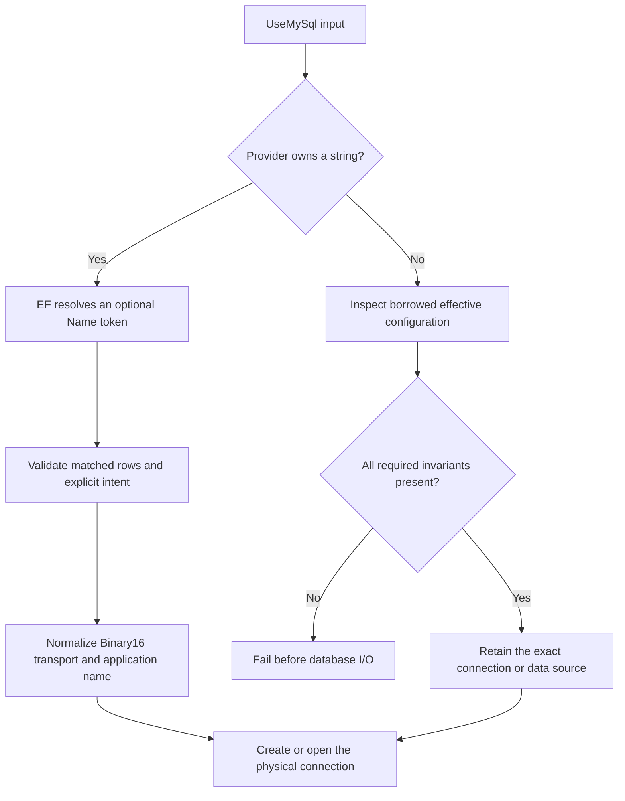

# Provider Configuration

This guide is the canonical map of application-facing provider configuration.
It groups the public entry points by lifetime and links specialized contracts
instead of duplicating them.

## Connection and Server Configuration

Configure the provider with exactly one of the `UseMySql(...)` inputs:

| Input | Use when | Ownership |
| --- | --- | --- |
| Connection string | The context should acquire pooled connector connections on demand. | The provider owns each opened connection; MySqlConnector owns the pool. |
| `DbConnection` | The host already created the connection or needs explicit connection lifetime control. | The host owns and disposes the supplied connection. |
| `MySqlDataSource` | Pooling, connector logging, TLS, credentials, or rotation are centralized by the host. | The host owns and disposes the data source. |

All three inputs share two unconditional provider invariants:

- MySqlConnector must use matched-row semantics (`UseAffectedRows=false`) so
  an update whose predicate matched is not reported as an optimistic
  concurrency conflict merely because the stored value was unchanged.
- MySqlConnector must use `GuidFormat=Binary16` as Doka's low-level transport.
  `DefaultGuidFormat(...)` and `HasMySqlGuidFormat(...)` still select each
  column's `binary(16)` or `char(36)` storage contract.

Doka applies the transport value to provider-owned strings after EF resolves a
possible `Name=ConnectionStrings:...` token. An explicitly conflicting
`UseAffectedRows=true`, `GuidFormat`, or legacy `OldGuids` value is rejected
instead of silently overwritten. For a caller-owned `DbConnection` or
`MySqlDataSource`, the caller must configure `GuidFormat=Binary16`; Doka
validates the effective string and retains the exact object without mutation,
cloning, or reconstruction.



Every overload requires a `MySqlServerVersion`. Prefer an explicit supported
engine line in production:

```csharp
options.UseMySql(
    connectionString,
    MySqlServerVersion.MariaDb(new Version(11, 8, 5)),
    mysql =>
    {
        mysql.CommandTimeout(30);
        mysql.EnableRetryOnFailure(maxRetryCount: 5);
    });
```

`MySqlServerVersion.MySql(...)` and `MariaDb(...)` avoid family inference.
`Parse(...)` accepts a server version string, including MariaDB's legacy
`5.5.5-...-MariaDB` prefix. Detection has two ownership contracts:

| Entry point | I/O and lifetime |
| --- | --- |
| `AutoDetect(string connectionString)` | Creates one temporary `MySqlConnection`, opens it synchronously once, reads the version, and disposes it on success or failure. |
| `AutoDetect(DbConnection)` | Reads the supplied connection's `ServerVersion`; does not open or dispose the caller-owned connection. Open it before detection. |

The connection-string overload is available from
[10.1.0](../CHANGELOG.md#1010---2026-08-27), not the `10.0.0` package:

```csharp
var serverVersion = MySqlServerVersion.AutoDetect(connectionString);
options.UseMySql(connectionString, serverVersion);
```

Reuse the returned immutable descriptor for an unchanged target rather than
detecting it every time a context is created. Doka does not cache or log the
connection string or add discovery retries. The temporary connection forces
`AutoEnlist=false`, even if the supplied string explicitly enables it, so
discovery does not join the caller's ambient transaction. Normal provider
connections and caller-owned detection connections keep their transaction
behavior. Pooling remains owned by MySqlConnector; the effective connection
options can select a pool distinct from normal provider connections.
Connection failures remain observable; detection is not an offline fallback.

`UseMySql(string, ...)` and `AutoDetect(string)` reject null, empty, or
whitespace input. Detection uses `SupportedOnly`; unsupported lines fail
provider option validation by default. `AllowUnsupported` remains an explicit
compatibility escape hatch on the existing descriptor and connection APIs,
not a support promise. See [Supported Databases](supported-databases.md) and
[Migrating from Pomelo](migrating-from-pomelo.md) for replacement examples.

## Context Options

The callback passed to `UseMySql(...)` exposes:

| Option | Contract |
| --- | --- |
| `CommandTimeout(seconds)` | Positive timeout applied to provider commands, including migrations and advisory-lock acquisition. |
| `DefaultGuidFormat(format)` | Default `Binary16` or `Char36` mapping for GUID properties. |
| `EnableRetryOnFailure(count, delay)` | Opts into the provider execution strategy for classified transient failures. |
| `MaxBatchSize(count)` | Caps statements in one modification batch; packet and parameter ceilings can split it further. |
| `MinBatchSize(count)` | Sets the minimum accumulated statement count for batched modification execution. |
| `MigrationsHistoryTable(name, schema)` | Selects the history table. A non-empty schema is rejected because MySQL-family databases do not implement EF Core schema semantics. |
| `RequireUserVariables()` | Requires MySqlConnector to pass `@name` tokens through as server-side user variables. Doka enables an omitted option for owned strings and validates borrowed inputs. |
| `UseQuerySplittingBehavior(behavior)` | Selects EF Core single- or split-query behavior for collection includes. |
| `UseNetTopologySuite()` | Activates services from the optional NetTopologySuite provider package. |

Use `RequireUserVariables()` when a library or application emits session-local
MySQL or MariaDB variables, including a `PREPARE ... FROM @sql` program:

```csharp
options.UseMySql(
    connectionString,
    serverVersion,
    mysql => mysql.RequireUserVariables());
```

For an owned string, omission is normalized to `AllowUserVariables=true`.
Explicit `false` is contradictory and fails locally. A borrowed connection or
data source must already specify both transport prerequisites:

```csharp
var builder = new MySqlConnectionStringBuilder(connectionString)
{
    AllowUserVariables = true,
    GuidFormat = MySqlConnector.MySqlGuidFormat.Binary16,
};

var dataSource = new MySqlDataSourceBuilder(builder.ConnectionString).Build();
```

`AllowUserVariables` is a connector parser capability, not a database
privilege, multi-statement switch, or server setting. Enabling it can select a
separate MySqlConnector pool because the effective connection configuration
changes.

EF runtime replacement follows the same ownership rules.
`Database.SetConnectionString(...)` is normalized only on a provider-owned
string path and is rejected on a borrowed connection or data-source path.
`Database.SetDbConnection(...)` validates an open or closed replacement before
EF accepts it; `contextOwnsConnection` changes disposal responsibility, not
configuration ownership. Direct mutation of a borrowed object after validation
is a caller contract violation and does not add parsing to query or command hot
paths.

Retry policy, commit-unknown handling, and proxy requirements are owned by
[Resilience and Topology](operations/resilience-and-topology.md). Host-side
dependency injection, telemetry, health checks, and data-source setup are owned
by [Host Integration](host-integration-examples.md).

## Model Configuration

| Scope | API | Contract |
| --- | --- | --- |
| Model | `HasCharSet(charSet)` | Sets the model default character set. |
| Model | `UseCollation(collation)` | Sets the canonical EF Core database collation. |
| Entity | `HasCharSet(charSet)` | Overrides the table character set. |
| Entity | `UseStorageEngine(engine)` | Selects the table storage engine. |
| Index | `HasPrefixLength(lengths)` | Supplies one non-negative prefix length per indexed property; zero selects the complete value. |
| Index | `IsFullText()` | Marks the index as full text. |
| Property or complex scalar property | `HasMySqlGuidFormat(format)` | Overrides GUID storage for one property. |
| Property | `HasMySqlValueGenerationStrategy(strategy)` | Selects `None`, `AutoIncrement`, `ClientGuid`, or `HiLo`. |
| Property | `UseMySqlAutoIncrementColumn()` | Selects auto-increment value generation. |
| Property | `UseMySqlClientGuidValueGeneration()` | Selects explicit client-side GUID generation. |
| Property | `UseHiLo(name, schema)` | Selects provider HiLo generation; MySQL emulates sequences and MariaDB uses native sequences. |
| Property | `IsInvisible()` | Marks a supported engine column `INVISIBLE`. |
| Spatial property | `HasSrid(srid)` | Registers the non-negative SRID expected by the spatial mapping. |
| Spatial index | `IsSpatial()` | Marks an explicit single-column spatial index. |

Database character set and collation are independent model facets. The
complete migration-preservation contract described here is available from
Doka 10.4.1. When both facets are configured, Doka preserves both through
migration source and emits them in one `ALTER DATABASE` statement before
tables that inherit the database default. A collation-only change remains
executable; a character-set-only configuration remains character-set-only and
intentionally lets the server choose that character set's default collation.
Doka rejects malformed and statically incompatible explicit pairs before
emitting SQL. Availability remains engine-version-specific; documented
MariaDB 10.10.1 and later `uca1400_*` collations are accepted only for MariaDB
Unicode character sets.

On an existing database, a character-set-only migration replaces any current
database collation with the server's configured default for that character
set. For `utf8mb4`, stock MySQL 8.4 selects `utf8mb4_0900_ai_ci`; MariaDB uses
`utf8mb4_general_ci` through 11.4 and `utf8mb4_uca1400_ai_ci` from 11.5. Server
configuration can override these defaults. A subsequently created textual
foreign key can therefore be incompatible with an existing principal column.
Configure both facets whenever a specific collation is part of the schema
contract. Removing the last explicit database default without a replacement is
rejected rather than reduced to a migration that cannot change the database.

Updating Doka does not rewrite an already generated migration. A migration
created by an affected provider version without
`AlterDatabaseOperation.Collation` remains incomplete because its checked-in
operation is the migration contract; the SQL generator does not infer missing
metadata from the current target model. Regenerate an unpublished migration
after updating Doka. If the migration has already been deployed, preserve its
history and create a reviewed forward migration that sets the intended
database default explicitly.

An explicit table collation remains a table override. An explicit table-default
transition changes the default for subsequently added textual columns without
converting existing columns; removing the override resets the table default to
the database default recorded in the target model. Doka rejects removal when
that target default is not configured because a mutable server default is not
deterministic migration input. Changing only the database default does not
convert existing tables or columns. Converting existing columns requires
explicit column migration operations and a separate data and locking review.

Changing an explicit storage engine emits `ALTER TABLE ... ENGINE = ...`.
Because the server may rebuild and lock the table, review that migration as a
physical data operation. Removing an explicit engine without selecting a
replacement is rejected rather than delegated to a mutable server default.

### Index key byte fidelity

Ordinary indexes, unique indexes, primary keys, alternate keys, and the
indexes EF creates for foreign keys share one byte budget. Doka calculates the
known ordered key width from the effective bounded store type, character set
or collation, explicit prefix lengths, binary lengths, and fixed-width key
parts. A definition above InnoDB's largest supported 3072-byte limit is
rejected during model validation. Full-text, spatial, and functional indexes
retain their separate feature contracts.

`HasPrefixLength(...)` is an explicit semantic choice. A positive entry limits
that key part; zero selects the complete value. Doka rejects a prefix longer
than its column and never creates a prefix automatically because doing so can
change selectivity and the meaning of a unique index.

Changing, adding, or removing the configured prefix lengths rebuilds the
existing physical index through one drop and one create migration operation.
The recreated index carries the target model's ordered values, including zero
entries for complete key parts. Treat this as online-deployment work: review
the engine's lock behavior and the table size before applying it.

Changing an existing ordinary index to `IsFullText()` or `IsSpatial()`, or
removing either designation, uses the same drop-and-create boundary because
the target is a different physical index kind.

The metadata comparison uses physical relational index identity. TPH has one
physical copy, TPT keeps indexes on their declaring tables, and a base index in
TPC is expanded with the same provider metadata onto every concrete table.
Rename-plus-metadata transitions rebuild those TPC copies independently.

Smaller InnoDB page sizes can impose lower limits: 8-KiB pages allow 1536
bytes and 4-KiB pages allow 768 bytes. A model alone cannot prove the live page
size, and historical or hand-authored migrations may bypass current model
validation. During EF migration execution, Doka therefore observes the
server's per-command diagnostics. If MySQL or MariaDB reports code 1071 after
accepting a command by shortening an index, Doka fails that command before EF
records the migration history entry.

MySQL-family DDL may already have committed when that failure becomes visible.
Inspect and remove or correct the partially created table or index, reduce the
declared length or configure a deliberate prefix, and then rerun the migration.
Do not insert the missing history row manually.

Temporal, application-time, and bitemporal table builders are documented in
[Temporal Tables](temporal-tables.md). The `UseWithoutOverlaps()` key and index
configuration is part of that same contract. Custom migration-operation
registration is documented in
[Migration Operation Handlers](migration-operation-handlers.md).

The separate `Doka.Caching.MySql` package registers
`AddDistributedMySqlCache(...)` without a `DbContext` or provider dependency.
Its `MySqlCacheOptions`, deployment-time `MySqlCacheSchema.GetCreateScript(...)`,
and runtime lifetime are owned by [Distributed Cache](distributed-cache.md).

## Reverse Engineering and Services

`AddEntityFrameworkDokaMySql(...)` registers runtime provider services for
advanced service-provider composition. Normal `DbContext` configuration should
use `UseMySql(...)` instead. The optional
`AddEntityFrameworkDokaMySqlNetTopologySuite(...)` extension adds its spatial
services to the same collection.

Design-time registration uses `AddEntityFrameworkDokaMySqlDesignTime(...)`.
Its `ScaffoldTextGuidsAsGuids()` option asks reverse engineering to treat
compatible `char(36)` and `varchar(36)` columns as `Guid`; it is opt-in because
text columns are not intrinsically GUID columns.

## Configuration Precedence

Use the narrowest scope that expresses the contract:

1. Provider options establish connection- and context-wide behavior.
2. Model and entity configuration establish database defaults.
3. Property or index configuration overrides the relevant default.
4. Engine capability validation remains authoritative; fluent configuration
   cannot make unsupported server syntax valid.

Do not use connector GUID options as a second model configuration surface. The
provider's `DefaultGuidFormat(...)` and `HasMySqlGuidFormat(...)` own the model,
parameter, literal, migration, and materialization contract together.
Caller-owned connections and data sources must nevertheless set connector
`GuidFormat=Binary16` as the one wire-transport prerequisite; Doka validates it
without treating it as a column-format choice.

For provider-owned `Char36` and `Binary16`, keep the model CLR type as `Guid` or
`Guid?`. The relational type mapping owns conversion to `char(36)` or the
provider's big-endian `binary(16)` layout; adding an application converter or
provider CLR type duplicates that responsibility and can create conflicting
relationship conversions. Application-owned conversions remain authoritative,
but every property in a relationship chain must use a compatible conversion
contract. Changing between text and binary storage, or adopting native
`Binary16` from an application byte converter, requires the staged data
migration described in [Migration Operations](operations/migrations.md#guid-representation-changes).
The context default and property override also apply to scalar GUID properties
inside non-collection complex types. Complex collections mapped as JSON retain
their JSON document contract rather than receiving per-member relational GUID
column metadata.

Parameterized primitive collections preserve the effective storage
representation of the property they are compared with. From 10.4.4, Doka
again uses EF Core 10's `MultipleParameters` default: ordinary
`keys.Contains(entity.Id)` emits scalar parameters so the database can see
collection cardinality. The one-JSON-parameter default in 10.4.3 could cause
excessive latency, including a timeout, on a selective relationship query.
No incorrect results were reported. Opt into `JSON_TABLE` only for measured
workloads with `EF.Parameter(keys).Contains(entity.Id)`.
The JSON parameter is decoded as the configured `binary(16)` representation
for `Binary16` and as value-preserving, collation-coercible text for `Char36`.

All three strategies remain available per query:

```csharp
var jsonRows = await context.Entities
    .Where(entity => EF.Parameter(keys).Contains(entity.Id))
    .ToListAsync();

var parameterRows = await context.Entities
    .Where(entity => EF.MultipleParameters(keys).Contains(entity.Id))
    .ToListAsync();

var constantRows = await context.Entities
    .Where(entity => EF.Constant(keys).Contains(entity.Id))
    .ToListAsync();
```

Use a provider option only when every parameterized collection in the context
should use another default:

```csharp
options.UseMySql(connectionString, serverVersion, mysql =>
    mysql.UseParameterizedCollectionMode(
        ParameterTranslationMode.Parameter));
```

The provider sets its default before invoking the application callback, so an
explicit callback value always wins. The multiple-parameter default exposes
collection cardinality to the optimizer. A large-list query can benefit from
one JSON parameter, but list length alone does not determine the best plan;
use a per-query override and verify its plan on every supported engine.
Different collection modes also produce separate EF Core internal service
providers, so a compiled query for one mode cannot determine another
context's translation. The options extension validates the final mode when
EF Core builds its internal service provider, including changes made after
`UseMySql`.

The selective one-million-row comparison and its limits are recorded in the
[performance evidence reference](operations/performance-evidence-reference.md#selective-membership-check).

If a connection uses the server's `NO_BACKSLASH_ESCAPES` SQL mode, configure
MySqlConnector's `NoBackslashEscapes=true` connection option to match it. Scalar
string parameters can otherwise compare incorrectly when they contain a
backslash. This is a driver/session-mode contract, not a reason to select JSON
globally. See [MySqlConnector connection options](https://mysqlconnector.net/connection-options/#NoBackslashEscapes).

String values that begin and end with quotes remain ordinary string values
rather than being interpreted as a second JSON document. Parameterized strings
and application values converted to a string provider type are transported as
Base64-encoded UTF-8 inside the JSON array and decoded as coercible `utf8mb4`
text. This keeps quote, backslash, empty-string, and non-ASCII values
independent of MariaDB's `NO_BACKSLASH_ESCAPES` mode while leaving the property
column authoritative for collation semantics, including columns with
non-default collations on MariaDB 10.11.

Nullable elements, `Guid.Empty`, duplicate keys, empty collections, and large
single-parameter collections retain normal LINQ membership semantics. The same
encoding rules apply when a model-mapped GUID collection is expanded through
`JSON_TABLE`. Application-owned converters retain their configured
model/provider conversion while `JSON_TABLE` extracts the provider type through
a lossless intermediate mapping. For composed parameter collections and
`ToJson()`-owned collections, those intermediate mappings preserve strings,
decimals, temporal values, GUIDs, and binary values. Property length, numeric
scale, and fractional-second precision are applied by the final comparison
instead of truncating or rounding a JSON value first. Positive and negative
`TimeSpan` values above 24 hours are converted from EF Core's JSON
representation to MySQL's elapsed-hour representation before that comparison.
Native and application-converted parameter values outside MySQL's signed
`TIME` range of `-838:59:59` through `838:59:59` are rejected during collection
serialization. This prevents the server from saturating an invalid comparison
value to a boundary that could match an unrelated row. `ToJson()` document
persistence remains unrestricted because those values are not converted to a
relational `TIME` value while being stored.

## Runnable Verification

- [HostExamples](../examples/Doka.EntityFrameworkCore.MySql.HostExamples/README.md)
  covers dependency injection, data sources, health checks, telemetry, and
  legacy `Char36` configuration.
- [GuidFormats](../examples/GuidFormats/README.md) covers provider- and
  property-level GUID selection.
- [CharSetAndCollation](../examples/CharSetAndCollation/README.md) covers model,
  entity, storage-engine, and index-prefix configuration.
- [SpatialQueries](../examples/SpatialQueries/README.md) covers
  `UseNetTopologySuite()`, SRIDs, and spatial indexes.
- The HiLo functional and integration suites cover native MariaDB sequences and
  MySQL sequence emulation.

`./eng/test-examples.sh` builds and verifies the public examples. Unit,
functional, and integration suites pin option validation, metadata precedence,
generated SQL, reverse engineering, and every supported engine line.
The server-version unit and driver integration tests cover both detection
entry points; the connection-string path is exercised against the supported
MySQL and MariaDB targets.

## Primary Sources

Retrieved 2026-08-21:

- [EF Core database providers](https://learn.microsoft.com/ef/core/providers/)
- [EF Core connection strings](https://learn.microsoft.com/ef/core/miscellaneous/connection-strings)
- [EF Core connection resiliency](https://learn.microsoft.com/ef/core/miscellaneous/connection-resiliency)
- [EF Core efficient querying and split queries](https://learn.microsoft.com/ef/core/performance/efficient-querying)
- [EF Core value generation](https://learn.microsoft.com/ef/core/modeling/generated-properties)
- [MySqlConnector data sources](https://mysqlconnector.net/overview/)

Retrieved 2026-08-26 for connection-string detection:

- [MySqlConnector connection opening](https://mysqlconnector.net/api/mysqlconnector/mysqlconnection/open/)
- [MySqlConnector connection reuse](https://mysqlconnector.net/troubleshooting/connection-reuse/)

Retrieved 2026-08-30 for connection invariants:

- [MySqlConnector connection options](https://mysqlconnector.net/connection-options/)
- [MySqlConnector 2.5.0 connection-string builder](https://github.com/mysql-net/MySqlConnector/blob/2.5.0/src/MySqlConnector/MySqlConnectionStringBuilder.cs)
- [MySqlConnector 2.5.0 data source](https://github.com/mysql-net/MySqlConnector/blob/2.5.0/src/MySqlConnector/MySqlDataSource.cs)
- [MySQL 8.4 `ROW_COUNT()`](https://dev.mysql.com/doc/refman/8.4/en/information-functions.html)
- [MySQL 8.4 user variables](https://dev.mysql.com/doc/refman/8.4/en/user-variables.html)
- [MySQL 8.4 prepared statements](https://dev.mysql.com/doc/refman/8.4/en/prepare.html)
- [EF Core 10 optimistic concurrency](https://learn.microsoft.com/ef/core/saving/concurrency)
- [EF Core 10.0.8 relational connection source](https://github.com/dotnet/efcore/blob/v10.0.8/src/EFCore.Relational/Storage/RelationalConnection.cs)

Retrieved 2026-08-31 for index-key fidelity:

- [MySQL 8.4 InnoDB limits](https://dev.mysql.com/doc/refman/8.4/en/innodb-limits.html)
- [MySQL 8.4 column indexes](https://dev.mysql.com/doc/refman/8.4/en/column-indexes.html)
- [MariaDB InnoDB limitations](https://mariadb.com/docs/server/server-usage/storage-engines/innodb/innodb-limitations)
- [MariaDB data-type storage requirements](https://mariadb.com/docs/server/reference/data-types/data-type-storage-requirements)
- [MariaDB `CREATE INDEX`](https://mariadb.com/docs/server/reference/sql-statements/data-definition/create/create-index)
- [MariaDB InnoDB row formats](https://mariadb.com/docs/server/server-usage/storage-engines/innodb/innodb-row-formats/innodb-row-formats-overview)
- [MySqlConnector `InfoMessage`](https://mysqlconnector.net/api/mysqlconnector/mysqlconnection/infomessage/)

Retrieved 2026-09-13 for character-set and collation migration fidelity:

- [MySQL 8.4 character sets and collations](https://dev.mysql.com/doc/refman/8.4/en/charset.html)
- [MySQL 8.4 database character-set and collation defaults](https://dev.mysql.com/doc/refman/8.4/en/charset-database.html)
- [MySQL 8.4 foreign-key constraints](https://dev.mysql.com/doc/refman/8.4/en/create-table-foreign-keys.html)
- [MariaDB character-set and collation configuration](https://mariadb.com/docs/server/reference/data-types/string-data-types/character-sets/setting-character-sets-and-collations)
- [MariaDB supported character sets and collations](https://mariadb.com/docs/server/reference/data-types/string-data-types/character-sets/supported-character-sets-and-collations)

Retrieved 2026-09-19 for parameterized primitive-collection representation:

- [EF Core 10 parameterized collection translation](https://learn.microsoft.com/en-us/ef/core/what-is-new/ef-core-10.0/breaking-changes#parameterized-collections-now-use-multiple-parameters-by-default)
- [MySQL 8.4 `JSON_TABLE`](https://dev.mysql.com/doc/refman/8.4/en/json-table-functions.html)
- [MySQL 8.4 `JSON_QUOTE`](https://dev.mysql.com/doc/refman/8.4/en/json-creation-functions.html)
- [MySQL 8.4 `JSON_UNQUOTE`](https://dev.mysql.com/doc/refman/8.4/en/json-modification-functions.html)
- [MySQL 8.4 cast functions and operators](https://dev.mysql.com/doc/refman/8.4/en/cast-functions.html)
- [MySQL 8.4 `FROM_BASE64`](https://dev.mysql.com/doc/refman/8.4/en/string-functions.html#function_from-base64)
- [MySQL 8.4 `TIME` type](https://dev.mysql.com/doc/refman/8.4/en/time.html)
- [MariaDB `JSON_TABLE`](https://mariadb.com/docs/server/reference/sql-functions/special-functions/json-functions/json_table)
- [MariaDB `JSON_QUOTE`](https://mariadb.com/docs/server/reference/sql-functions/special-functions/json-functions/json_quote)
- [MariaDB `JSON_UNQUOTE`](https://mariadb.com/docs/server/reference/sql-functions/special-functions/json-functions/json_unquote)
- [MariaDB `FROM_BASE64`](https://mariadb.com/docs/server/reference/sql-functions/secondary-functions/encryption-hashing-and-compression-functions/from_base64)
- [MariaDB `CONVERT`](https://mariadb.com/docs/server/reference/sql-functions/string-functions/convert)
- [MariaDB `TIME` type](https://mariadb.com/docs/server/reference/data-types/date-and-time-data-types/time)
